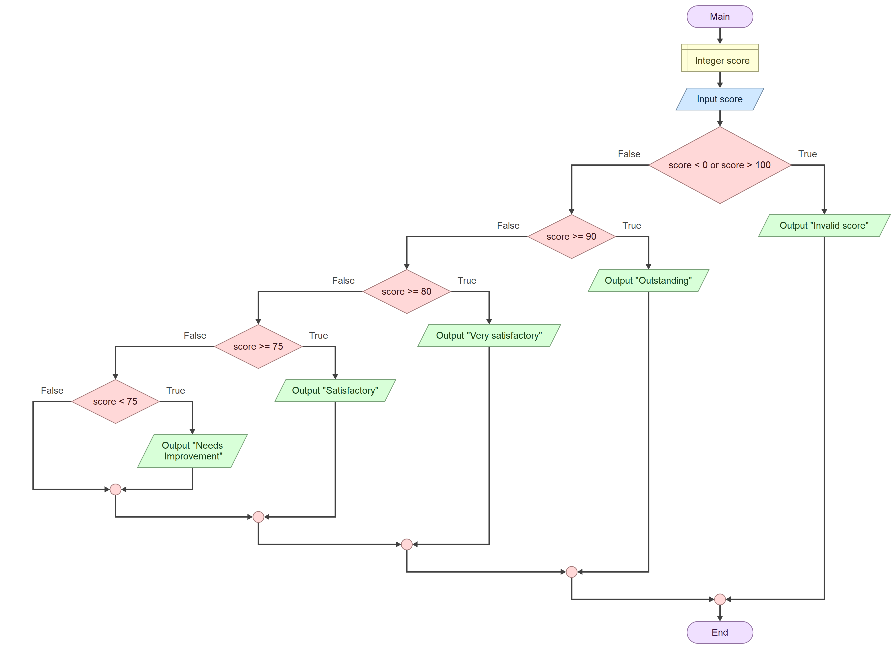

# Part 1 - Analyze the Logic

## What information does the program need?
> The program needs a student's score as an input

## What is the minimum valid score?
> Minimum: 0

## What is the maximum valid score?
> Maximum: 100

## What outcomes can the program producs?
> It can produce, Outstanding, Very Satisfactory, Satisfactory, Needs Improvement and Invalid Score.

## Which prt uses a boundary condition
> The program checks if the score is below 0 or above 100. If it is outside this range, the program displays "Invalid Score."

## Which part uses multiple decision parts?
> The program uses `if`, `elif`, and `else` statements to choose the correct classification based on the student's score. It checks the score from the highest classification to the lowest until the correct result is found.

# Part 2 - Create the Flowchart
## Link to flowchart: 

# Part 3 - Write the Pseudocode
START

INPUT score

IF score >= 90 AND score <= 100

→ DISPLAY "Outstanding"

ELSE IF score >= 80 AND score <= 89

→ DISPLAY "Very Satisfactory"

ELSE IF score >= 75 AND score <= 79

→ DISPLAY "Satisfactory"

ELSE IF score < 75

→ DISPLAY "Needs Improvement"

END

# Part 4 - Clean Code Implementation
## Link to python file: 

# Part 5 - Test the Program
------------------------------------------------------------------------------------------------------
| Test |  Input  |            Purpose           | Expected Output     |  Actual Output        | Result |
|      |---------|------------------------------|-------------------- |---------------------- |--------|
| 1    |  -1     | Below minimum                | Invalid Score       | Invalid Score         | PASS   |
|------|---------|------------------------------|-------------------- |---------------------- |--------|
| 2    |  0      | Minimum boundary             | Needs Improvement   | Needs Improvement     | PASS   |
|------|---------|------------------------------|-------------------- |---------------------- |--------|
| 3    |  74     | Below satisfactory boundary  | Needs Improvement   | Needs Improvement     | PASS   |
|------|---------|------------------------------|-------------------- |---------------------- |--------|
| 4    |  75     | Satisfactory boundary        | Satisfactory        | Satisfactory          | PASS   |
|------|---------|------------------------------|-------------------- |---------------------- |--------|
| 5    |  80     | Very satisfactory boundary   | Very Satisfactory   | Very Satisfactory     | PASS   |
|------|---------|------------------------------|-------------------- |---------------------- |--------|
| 6    |  90     | Outstanding boundary         | Outstanding         | Outstanding           | PASS   |
|------|---------|------------------------------|-------------------- |---------------------- |--------|
| 7    |  100    | Maximum boundary             | Outstanding         | Outstanding           | PASS   |
|------|---------|------------------------------|-------------------- |---------------------- |--------|
| 8    |  101    | Above maximum                | Invalid Score       | Invalid Score         | PASS   |
|------|---------|------------------------------|-------------------- |---------------------- |--------|

# Reflection
